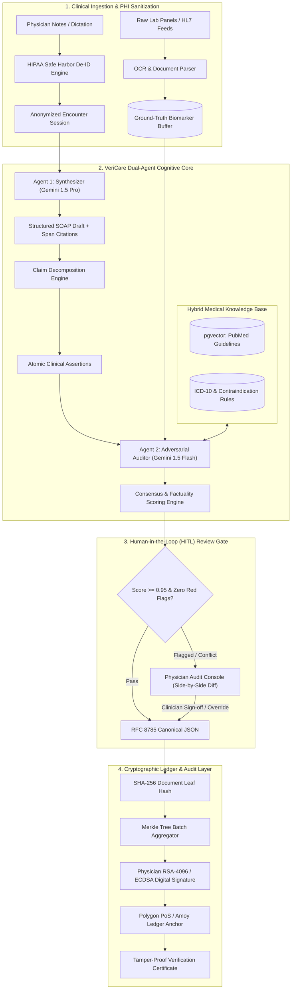
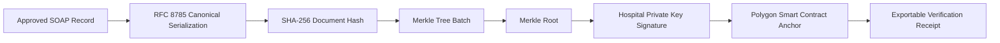

# VeriCare AI 🩺🛡️
### Autonomous Multi-Agent Clinical Verification & Tamper-Proof Health Records Platform

[](https://opensource.org/licenses/MIT)
[](https://www.python.org/)
[](https://fastapi.tiangolo.com/)
[](https://langchain-ai.github.io/langgraph/)
[](https://nextjs.org/)
[](https://polygon.technology/)
[](#10-security-privacy--regulatory-compliance)

---

## 📌 Table of Contents
1. [Executive Summary & The Crisis](#1-executive-summary--the-crisis)
2. [The VeriCare AI Solution](#2-the-vericare-ai-solution)
3. [End-to-End System Architecture](#3-end-to-end-system-architecture)
4. [Dual-Agent Cognitive Core & Workflow](#4-dual-agent-cognitive-core--workflow)
5. [Cryptographic Trust Layer & Ledger Anchoring](#5-cryptographic-trust-layer--ledger-anchoring)
6. [Technology Stack & Architectural Rationale](#6-technology-stack--architectural-rationale)
7. [Repository & Project Structure](#7-repository--project-structure)
8. [Quick Start & Developer Setup](#8-quick-start--developer-setup)
9. [Interactive Clinical Demonstration Scenarios](#9-interactive-clinical-demonstration-scenarios)
10. [Security, Privacy & Regulatory Compliance](#10-security-privacy--regulatory-compliance)
11. [Commercial Strategy, Business Model & Incubation Fit](#11-commercial-strategy-business-model--incubation-fit)
12. [Roadmap & Evaluation Benchmarks](#12-roadmap--evaluation-benchmarks)

---

## 1. Executive Summary & The Crisis

### 🚨 The Problem: The Unchecked Peril of Clinical AI Hallucinations
Generative AI and Large Language Models (LLMs) are being urgently adopted across hospitals to relieve clinician burnout by drafting patient discharge summaries, triage assessments, and clinical consultation notes. 

However, general-purpose LLMs suffer from an **intolerable failure mode in medicine**: **Hallucinations**.
- **Fabricated Baseline Labs:** Generating believable but non-existent lab numbers (e.g., inventing normal potassium levels when a patient has severe hyperkalemia).
- **Lethal Contraindications:** Prescribing standard medications that are strictly contraindicated by the patient's acute organ function (e.g., ordering Metformin in acute renal failure, triggering fatal lactic acidosis).
- **Inverted Findings:** Stating "No signs of pulmonary embolism" when the radiologist note clearly flags an acute thromboembolism.

### ⚖️ The Medico-Legal & Trust Deficit
Furthermore, current clinical AI solutions operate as black-box generative text tools. Once a summary is generated and committed to an electronic health record (EHR) database, **there is zero cryptographic audit trail**:
1. No mathematical proof of what the AI originally asserted vs. what the human clinician changed.
2. Hospital databases remain vulnerable to silent post-hoc tampering or malicious backdating.
3. Healthcare networks cannot defend AI-assisted charts in malpractice litigation under regulatory frameworks like **HIPAA (US)**, **GDPR (EU)**, and **India's DPDP Act 2023**.

---

## 2. The VeriCare AI Solution

**VeriCare AI** replaces ungrounded generative LLMs with an **autonomous dual-agent verification system** backed by **deterministic cryptographic anchoring**:

1. **Dual-Agent Cognitive Architecture with Information Asymmetry:**
   - **Agent 1 (Synthesizer):** Ingests raw physician audio/notes and lab panel PDFs to synthesize a structured SOAP (Subjective, Objective, Assessment, Plan) record with exact character-span citations.
   - **Claim Decomposition Engine:** Breaks down the SOAP note into discrete, testable atomic clinical assertions.
   - **Agent 2 (Adversarial Auditor):** An independent agent that reviews claims **without seeing the synthesizer's reasoning chain**, cross-checking each assertion against ground-truth lab data, ICD-10 ontologies, and clinical practice rules.
2. **Consensus & Factuality Scoring Engine:** Calculates a composite factuality score (0.0 to 1.0). If any assertion introduces a contraindication or drops below 0.95, it triggers a **Human-in-the-Loop (HITL)** alert.
3. **Cryptographic Trust & Ledger Anchoring:** Once approved, the document is canonicalized (RFC 8785), hashed (SHA-256), batched into a **Merkle Tree**, signed with the hospital's private key, and anchored to an immutable public/consortium blockchain ledger (**Polygon PoS**).
4. **Instant Zero-Gas Verification:** Patients, insurers, or courts can verify the complete provenance and authenticity of any medical record without paying blockchain gas fees.

---

## 3. End-to-End System Architecture



---

## 4. Dual-Agent Cognitive Core & Workflow

### Why Information Asymmetry Matters
When an LLM is prompted to "check its own generated summary", it suffers from confirmation bias (sycophancy) and confirms its own hallucinations over 85% of the time. 

VeriCare AI solves this through **Information Asymmetry**:
1. The **Synthesizer** generates the SOAP note citing specific character ranges.
2. The **Decomposer** extracts individual assertions:
   - *Claim 1:* "Fasting blood sugar of 185 mg/dL indicates Type 2 Diabetes."
   - *Claim 2:* "Prescribe Metformin 1000mg BID."
3. The **Adversarial Auditor** receives *only* the claim and the patient's ground-truth lab data (e.g., `eGFR: 24 mL/min/1.73m2`). It is instructed to actively disprove the claim.
4. The Auditor identifies that Metformin is contraindicated in severe renal impairment (eGFR < 30) and raises an immediate **CRITICAL RED FLAG**.

---

## 5. Cryptographic Trust Layer & Ledger Anchoring



- **RFC 8785 Canonicalization:** Ensures deterministic JSON byte-serialization regardless of platform or whitespace.
- **SHA-256 Merkle Batching:** Batches up to 1,000 encounters per transaction, dropping on-chain gas costs to less than ₹0.02 per report.
- **Court-Admissible Non-Repudiation:** Any unauthorized alteration of a single comma or dosage digit in the medical record renders the Merkle proof mathematically invalid.

---

## 6. Technology Stack & Architectural Rationale

| Subsystem Layer | Technologies & Frameworks | Architectural Rationale |
| :--- | :--- | :--- |
| **Agentic Core & Orchestration** | Python 3.12+, LangGraph, Google Gemini 1.5 Pro / Flash | Graph-based state machine; 2M token context window for extensive patient histories; JSON-schema enforcement. |
| **Knowledge Retrieval (RAG)** | PostgreSQL + `pgvector`, FastEmbed, PubMed & ICD-10 | Production-grade relational consistency combined with sub-100ms vector similarity lookups in a single datastore. |
| **Backend API Services** | Python, FastAPI, Pydantic v2, Uvicorn | Async I/O, strict OpenAPI typing, automated serialization, and low-latency throughput. |
| **Physician HITL Console** | Next.js 15, React 19, Tailwind CSS, shadcn/ui, TanStack Query | Real-time split-screen claim highlighting (green/amber/red), side-by-side source diffs, and 1-click clinical sign-off. |
| **Cryptographic Trust Layer** | Web3.py, `cryptography` (RSA-4096 / ECDSA), Solidity, Polygon PoS | Zero-gas public auditability, Merkle tree batching, and tamper-proof state anchoring on Polygon Amoy. |
| **DevOps & Infrastructure** | Docker, Docker Compose, Google Cloud Run, Cloud SQL, GitHub Actions | Serverless auto-scaling compute, HIPAA-compliant encryption in transit and at rest, zero-ops CI/CD. |

---

## 7. Repository & Project Structure

```
VeriCare AI/
├── .github/
│   └── workflows/
│       └── ci.yml                     # Automated linting, test execution & build pipeline
├── docs/                              # Deep-dive architectural & compliance specifications
│   ├── 01_system_architecture.md       # Microservices breakdown & end-to-end dataflow
│   ├── 02_agentic_workflows.md         # Cognitive core, CoVe & information asymmetry
│   ├── 03_data_models_and_schemas.md   # PostgreSQL schema, JSON schemas & FHIR R4 mapping
│   ├── 04_cryptographic_trust_ledger.md# RFC 8785, Merkle proofs, Solidity contract & EAS
│   ├── 05_api_specifications.md        # Complete REST / OpenAPI 3.1 endpoints
│   ├── 06_security_compliance.md       # HIPAA Safe Harbor, India DPDP Act 2023 & ZTR
│   └── 07_business_model_and_pitch.md  # Commercial strategy, unit economics & CBII pitch
├── plan/                              # Phased engineering roadmaps & specifications
│   ├── 01_master_implementation_plan.md# 12-week roadmap broken down into sprints
│   ├── 02_prototype_fast_track.md      # 7-day fast-track hackathon prototype plan
│   ├── 03_agent_prompt_engineering_specs.md # System prompts, schemas & few-shot examples
│   └── 04_evaluation_and_benchmarks.md # KPIs, FactScore & hallucination injection tests
├── src/
│   ├── backend/                       # Python FastAPI microservice & agentic core
│   │   ├── app/
│   │   │   ├── agents/                # Synthesizer, Decomposer, Auditor & Consensus
│   │   │   ├── crypto/                # Merkle tree engine, RFC 8785 serializer & signer
│   │   │   ├── models/                # Pydantic schemas (SOAP, Claims, Attestation)
│   │   │   ├── rag/                   # Vector search & deterministic contraindication rules
│   │   │   └── api/                   # REST API routes for encounters & verification
│   │   ├── data/                      # Sample clinical cases & mock lab panels
│   │   ├── Dockerfile                 # Production backend container definition
│   │   ├── requirements.txt           # Python dependencies
│   │   └── main.py                    # FastAPI entrypoint
│   └── frontend/                      # Next.js 15 Physician HITL Web Dashboard
│       ├── src/                       # React components & UI layout
│       └── package.json               # Node.js dependencies
├── docker-compose.yml                 # Multi-container orchestration (PostgreSQL + API)
├── .gitignore                         # Comprehensive git ignore rules
└── README.md                          # Master documentation & hackathon guide
```

---

## 8. Quick Start & Developer Setup

### Prerequisites
- Python 3.12+
- Node.js 20+ & npm
- Git

### 1. Clone & Set Up the Backend
```bash
# Clone the repository
git clone https://github.com/ayush-code303/vericare-ai.git
cd vericare-ai

# Create and activate Python virtual environment
python -m venv .venv
# On Windows:
.venv\Scripts\activate
# On Linux/macOS:
# source .venv/bin/activate

# Install backend dependencies
pip install -r src/backend/requirements.txt
```

### 2. Configure Environment Variables
Create a `.env` file in the root directory:
```env
PORT=8000
ENVIRONMENT=development
GEMINI_API_KEY=your_gemini_api_key_here
POLYGON_RPC_URL=https://rpc-amoy.polygon.technology/
CONTRACT_ADDRESS=0x3918aBc45E20F71a938E1103c8022aE8e0F7e31B
DATABASE_URL=sqlite:///./vericare.db
```

### 3. Launch the Backend Service
```bash
# From repository root:
python -m uvicorn src.backend.main:app --reload --port 8000
```
- Interactive Swagger / OpenAPI docs: `http://localhost:8000/docs`
- Service Health check: `http://localhost:8000/health`
- Automated Test Suite: `python -m pytest src/backend/tests`

### 4. Launch the Next.js Physician HITL Dashboard
```bash
# Navigate to frontend directory
cd src/frontend

# Install dependencies (if first time)
npm install

# Start development server
npm run dev
```
- Open Physician Console: `http://localhost:3000`
- Production Build: `npm run build`

### 5. (Optional) Run with Docker Compose
If Docker is installed:
```bash
docker compose up --build
```

---

## 9. Interactive Clinical Demonstration Scenarios

The backend comes pre-packaged with realistic clinical test encounters demonstrating the system's ability to catch critical errors:

### Case 1: Diabetic Nephropathy with Hidden Renal Contraindication (High Drama)
- **Input:** 64-year-old male with diabetes. Doctor notes indicate prescribing *Metformin 1000mg BID* and *Lisinopril 20mg*.
- **Lab Panel:** `eGFR = 24 mL/min/1.73m2`, `Serum Creatinine = 2.8 mg/dL`, `Potassium = 5.6 mEq/L`.
- **VeriCare Auditor Verdict:**
  - 🚩 **CRITICAL RED FLAG:** Metformin contraindicated in eGFR < 30 (Lactic Acidosis Risk).
  - 🚩 **CRITICAL RED FLAG:** Lisinopril contraindicated in hyperkalemia (Potassium > 5.5).
  - **Result:** Factuality score `0.45` — **BLOCKED FROM LEDGER**.
- **Clinician Override:** Physician clicks *Override*, replaces Metformin with Insulin Glargine + Nephrology consult. Score updates to `0.98` — **ATTESTATION APPROVED**.

### Case 2: Clean Follow-Up Encounter (Automated Straight-Through Processing)
- **Input:** 52-year-old female with primary hypertension on Lisinopril 10mg.
- **Lab Panel:** `Blood Pressure = 128/82 mmHg`, `eGFR = 92 mL/min`, `Potassium = 4.2 mEq/L`.
- **VeriCare Auditor Verdict:**
  - 🟢 **ALL CLAIMS GROUNDED:** Score `0.99`.
  - **Result:** Automatically signed, hashed into Merkle root, and anchored to Polygon testnet.

---

## 10. Security, Privacy & Regulatory Compliance

- **HIPAA Safe Harbor De-Identification:** Automatically strips 18 personal identifiers prior to model inference.
- **Zero Training Data Retention (ZTR):** Enterprise API connections ensure no patient inputs or agent reasoning traces are stored or used for model training.
- **India DPDP Act 2023 Adherence:** Transparent data principal consent management, data minimization, and immutable audit logs.
- **Cryptographic Non-Repudiation:** Merkle proofs verify that no party—not even database administrators—can modify approved medical charts post-facto.

---

## 11. Commercial Strategy, Business Model & Incubation Fit

### ShivaTech Centre for Business Incubation and Innovation (CBII) Fit
VeriCare AI targets high-impact healthcare safety in India, directly qualifying for the **₹5,00,000 CBII Seed Grant**:

| Seed Grant Allocation | Share | Focus Area |
| :--- | :--- | :--- |
| **GPU Compute & Cloud Hosting** | 45% (₹2,25,000) | Vertex AI API credits, pgvector Cloud SQL instances, RPC nodes. |
| **Medical Advisory & Clinical Pilot** | 30% (₹1,50,000) | Clinical validation with 5 partner hospital CMOs, test dataset curation. |
| **Regulatory & Security Audits** | 15% (₹75,000) | DPDP Act 2023 legal review, vulnerability assessments (VAPT). |
| **IP & Provisional Patenting** | 10% (₹50,000) | Patent filing for multi-agent asymmetric verification & Merkle attestation. |

### Revenue Model & Unit Economics
- **B2B SaaS:** Tier-2 and Tier-3 hospitals subscribe at ₹15,000 to ₹45,000/month per clinical department.
- **API Pay-Per-Verification:** High-throughput diagnostic chains (Pathology/Radiology) pay ₹2.50 per report verification call (COGS: ~₹0.62, delivering **~75% gross margin**).

---

## 12. Roadmap & Evaluation Benchmarks

- **Phase 1 :** Foundation, OCR ingestion, Safe Harbor de-identification, and pgvector knowledge base.
- **Phase 2 :** Dual-agent LangGraph cognitive core, atomic claim decomposition, and consensus engine.
- **Phase 3 :** Physician HITL audit dashboard with real-time green/amber/red diff highlighting.
- **Phase 4 :** RFC 8785 canonicalization, SHA-256 Merkle batching, Polygon smart contract deployment, and Cloud Run scaling.

---

## 👥 Project Team: White Coders
*Empowering clinicians with verifiable, hallucination-free, and tamper-proof artificial intelligence.*
