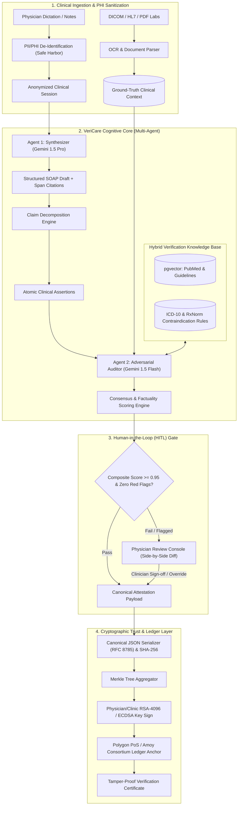

# VeriCare AI — System Architecture Specification

## 1. Executive Architecture Summary

**VeriCare AI** is an enterprise-grade, dual-agent clinical synthesis and verification platform designed to eradicate generative hallucinations in hospital Electronic Health Record (EHR) workflows while guaranteeing immutable tamper-proofing through cryptographic ledger anchoring.

Traditional clinical AI architectures rely on single-pass generative models, which lack accountability and frequently invent ("hallucinate") negative symptoms, unsupported dosages, or incorrect diagnostic baselines. VeriCare AI introduces a **Separation-of-Concerns Cognitive Architecture** paired with an **Immutable Trust Layer**.

---

## 2. Microservice Decomposition

VeriCare AI adopts a decoupled, asynchronous microservices architecture to provide maximum horizontal scalability, fault tolerance, and strict compliance isolation.

### 2.1 Services Overview

| Microservice | Primary Language / Framework | Core Responsibility | Communication Protocol |
| :--- | :--- | :--- | :--- |
| **Ingestion & De-ID Service** | Python, FastAPI, Presidio / spaCy | Strips 18 HIPAA Safe Harbor identifiers; extracts character spans from scanned lab panels. | Internal REST / gRPC |
| **Agentic Cognitive Core** | Python, LangGraph, Google Gemini 1.5 | Executes dual-agent synthesis, atomic claim extraction, adversarial critique, and consensus scoring. | Async Queue (Redis / Celery) |
| **Clinical Knowledge Service (RAG)** | Python, PostgreSQL + pgvector, FastEmbed | Conducts hybrid semantic vector search over medical literature and deterministic rule checking (ICD-10, contraindications). | SQL / Direct pgvector pool |
| **Cryptographic Trust Service** | Python / TypeScript, Web3.py, cryptography | Computes canonical hashes, builds SHA-256 Merkle batches, signs receipts, and anchors proofs to Polygon testnet. | REST / RPC |
| **HITL Web Console** | TypeScript, Next.js 15, Tailwind CSS, shadcn/ui | Clinician audit dashboard with interactive red/amber/green claim highlighting and 1-click override. | HTTPS / WebSocket |

---

## 3. Detailed Dataflow and Component Responsibilities

### 3.1 Stage 1: Ingestion & PHI De-Identification
1. **Inputs:** Raw typed notes, speech-to-text dictations, structured laboratory reports (HL7 FHIR / JSON), and scanned PDF lab panels.
2. **De-Identification:** Strips patient identifiers (Name, SSN, MRN, Telephone, Geographic subdivisions smaller than state) in accordance with the HIPAA Safe Harbor method. An internal pseudorandom deterministic session key maps the patient for secure hospital-side re-identification.
3. **Ground-Truth Extraction:** Lab biomarkers (e.g., `HbA1c = 8.4%`, `Serum Creatinine = 1.3 mg/dL`) are extracted with verbatim character spans and stored in an immutable context buffer.

### 3.2 Stage 2: Dual-Agent Synthesis & Adversarial Audit
1. **Synthesizer Agent:**
   - Prompted with strict JSON Schema constraints.
   - Formats input into clinical **SOAP** (Subjective, Objective, Assessment, Plan).
   - Generates exact source references for every clinical assertion.
2. **Claim Decomposition Engine:**
   - Splits generated SOAP sections into discrete atomic claims:
     * *Example:* "Patient has Type 2 Diabetes" (Assessment claim)
     * *Example:* "Prescribed Metformin 500mg BID" (Plan claim)
3. **Adversarial Auditor Agent (Information Asymmetry):**
   - Evaluates claims without seeing the Synthesizer’s internal reasoning chain, avoiding confirmation bias.
   - Cross-checks against the patient's ground-truth lab data.
   - Performs RAG similarity search against clinical practice guidelines (pgvector).
   - Evaluates deterministic contraindication rules (e.g., Metformin contraindicated if eGFR < 30 mL/min).

### 3.3 Stage 3: Consensus Scoring & Decision Matrix
The Consensus Engine calculates a multi-dimensional metric:
$$\text{Score}_{\text{Factuality}} = w_1 \cdot S_{\text{Grounding}} + w_2 \cdot S_{\text{Literature}} - w_3 \cdot P_{\text{Contradiction}}$$
- **Grounded (>= 0.95, Green):** Automatically passed to cryptographic attestation.
- **Ambiguous (0.80 - 0.94, Amber):** Flagged for optional clinician confirmation.
- **Contradiction / Hallucination (< 0.80, Red):** Hard gate; requires active physician intervention and explanation.

### 3.4 Stage 4: Cryptographic Trust & Non-Repudiation
1. **Canonicalization:** The approved record is serialized according to RFC 8785 (Deterministic JSON Canonicalization) to ensure byte-level determinism across platforms.
2. **Hashing:** Generates SHA-256 fingerprint of the canonical document.
3. **Merkle Aggregation:** Multiple encounters are bundled into a Merkle Tree to minimize on-chain transaction overhead.
4. **Digital Signature:** Signed with the clinician's or medical institution's private key (RSA-4096 or ECDSA secp256k1).
5. **Blockchain Anchoring:** Merkle root and transaction digest are anchored to Polygon PoS / Amoy testnet.
6. **Audit Verification:** Anyone with the original document and Merkle proof can verify authenticity instantly via a public, zero-gas verification endpoint.
