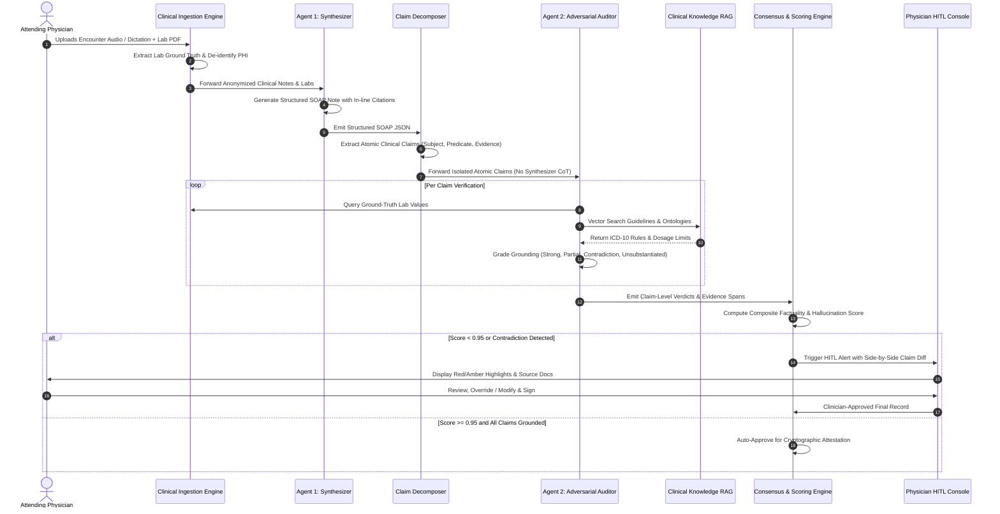

# VeriCare AI — Agentic Workflows & Multi-Agent Cognitive Core

## 1. Overview of the Cognitive Core

Clinical LLMs deployed in real-world hospitals suffer from the **"Sycophancy & Self-Reinforcing Delusion"** failure mode: when a single model generates text and is subsequently prompted to check its own work, it exhibits high confidence in its own hallucinations.

VeriCare AI solves this through a **Tripartite Multi-Agent Architecture** governed by **Information Asymmetry**:



---

## 2. Agent 1: The Synthesizer Agent

### 2.1 Role & Objective
- **Model:** Google Gemini 1.5 Pro (Selected for 2M token context window, enabling ingestion of extensive patient longitudinal history alongside acute lab feeds).
- **Core Task:** Ingest multi-modal clinical inputs and construct a comprehensive, standardized SOAP (Subjective, Objective, Assessment, Plan) record.
- **Strict Output Schema:** Every statement in the Assessment and Plan must explicitly reference a specific biomarker or subjective complaint from the Objective/Subjective sections.

### 2.2 Citation Grounding Protocol
The Synthesizer does not output bare text. It outputs character-indexed citations:
```json
{
  "section": "assessment",
  "statement": "Patient presents with uncontrolled Type 2 Diabetes Mellitus with early-stage diabetic nephropathy.",
  "citations": [
    {
      "source_document": "lab_panel_2026_10_06.pdf",
      "biomarker": "HbA1c",
      "reported_value": "9.2%",
      "reference_range": "< 5.7%",
      "source_span": [142, 168]
    },
    {
      "source_document": "lab_panel_2026_10_06.pdf",
      "biomarker": "Microalbumin/Creatinine Ratio",
      "reported_value": "180 mg/g",
      "reference_range": "< 30 mg/g",
      "source_span": [412, 455]
    }
  ]
}
```

---

## 3. Claim Decomposition Engine

Before passing the text to the Auditor, VeriCare AI utilizes an intermediate deterministic Claim Decomposition parser. Complex sentences are atomized into single-assertion tuples:

$$\text{SOAP Sentence} \xrightarrow{\text{Decomposer}} \{ \text{Claim}_1, \text{Claim}_2, \dots, \text{Claim}_k \}$$

### Example:
- **Raw Sentence:** *"Patient has acute kidney injury secondary to dehydration, currently on Lisinopril 20mg daily which should be held."*
- **Decomposed Claims:**
  1. `Claim 1`: Condition = Acute Kidney Injury.
  2. `Claim 2`: Etiology = Dehydration.
  3. `Claim 3`: Current Medication = Lisinopril 20mg daily.
  4. `Claim 4`: Clinical Action = Hold Lisinopril.

Each decomposed claim is checked independently, preventing compound sentences from masking subtle errors.

---

## 4. Agent 2: The Adversarial Auditor Agent

### 4.1 Principle of Information Asymmetry
The Auditor Agent operates under strict **Information Asymmetry**:
1. It does **not** see the Synthesizer’s conversational prompt or reasoning tokens.
2. It receives only:
   - The decomposed atomic claim.
   - The primary patient ground truth (OCR lab results, physician raw dictation).
   - Knowledge base retrieval context (pgvector).
3. This eliminates sycophantic agreement and forces independent verification.

### 4.2 Error Taxonomy Checked by Auditor
The Auditor classifies every claim against a standard medical hallucination taxonomy:

| Error Category | Clinical Impact | Verification Logic |
| :--- | :--- | :--- |
| **Fabricated Lab Baseline** | Extreme | Claim asserts a specific numerical lab value not present in ingested lab panels. |
| **Inverted Finding** | Extreme | Patient test is negative (e.g. *No pulmonary embolism*), but note states positive. |
| **Dosage Contraindication** | Severe | Medication dosage exceeds maximum safe threshold (e.g. Metformin in eGFR < 30). |
| **Drug-Drug Interaction** | Severe | Prescribed drug has high-risk interaction with existing active medication list. |
| **Unsubstantiated Inference** | Moderate | Clinical conclusion drawn without supporting biomarkers or physical exam observations. |

---

## 5. Consensus & Factuality Scoring Engine

The consensus engine computes a deterministic confidence score for each claim $c_i \in C$:

$$\text{Confidence}(c_i) = \alpha \cdot \text{Grounding}(c_i, \mathcal{D}_{\text{raw}}) + \beta \cdot \text{Literature}(c_i, \mathcal{K}) - \gamma \cdot \text{RiskPenalty}(c_i)$$

Where:
- $\text{Grounding}(c_i, \mathcal{D}_{\text{raw}}) \in [0, 1]$ represents direct string / entity alignment with raw lab documents.
- $\text{Literature}(c_i, \mathcal{K}) \in [0, 1]$ represents cosine similarity and ontology agreement with verified medical guidelines.
- $\text{RiskPenalty}(c_i) \in \{0, 0.5, 1.0\}$ penalizes lethal contraindications.

### Final Encounter Classification:
- **Green (Verified):** Overall score $\ge 0.95$, zero red flags. Document is routed directly to cryptographic attestation.
- **Amber (Review Recommended):** Score between $0.80$ and $0.94$. Minor phrasing uncertainty or borderline biomarker inference.
- **Red (Critical Contradiction):** Score $< 0.80$ or any high-risk contraindication. Document is locked until attending clinician performs manual sign-off.
