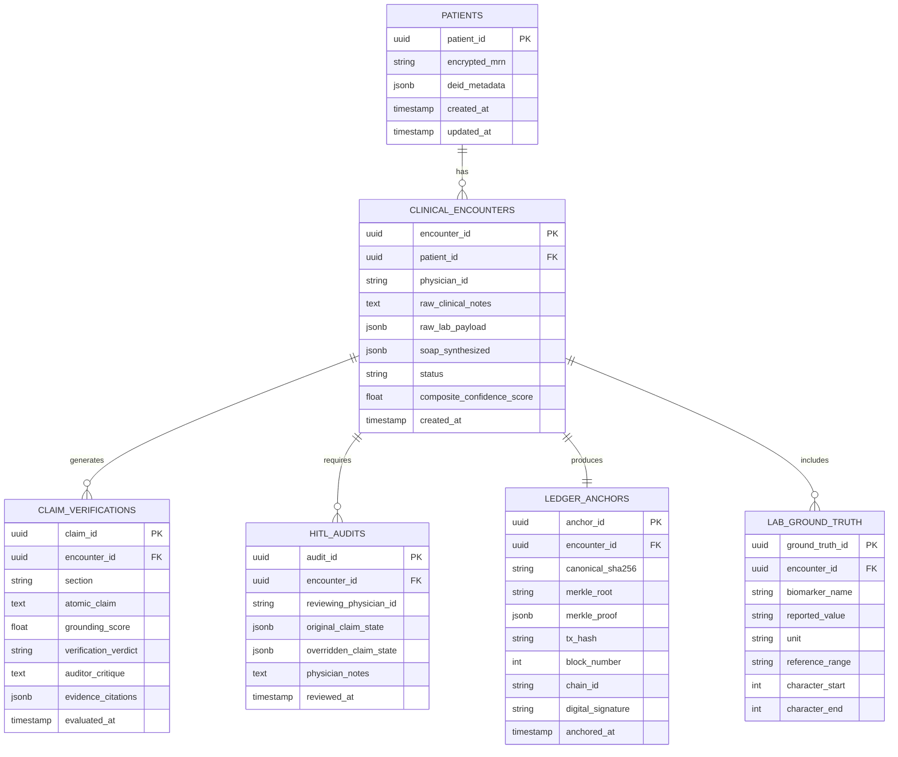

# VeriCare AI — Data Models & Schemas Specification

## 1. Relational Database Schema (PostgreSQL + pgvector)

VeriCare AI maintains complete auditability across raw inputs, agent iterations, human-in-the-loop decisions, and cryptographic receipts.



---

## 2. Structured SOAP JSON Schema

The Synthesizer Agent strictly validates against this JSON schema prior to dispatching claims to the Auditor.

```json
{
  "$schema": "http://json-schema.org/draft-07/schema#",
  "title": "VeriCareSOAPRecord",
  "type": "object",
  "required": [
    "encounter_id",
    "subjective",
    "objective",
    "assessment",
    "plan",
    "source_citations"
  ],
  "properties": {
    "encounter_id": { "type": "string", "format": "uuid" },
    "patient_session_id": { "type": "string" },
    "subjective": {
      "type": "object",
      "required": ["chief_complaint", "history_of_present_illness", "review_of_systems"],
      "properties": {
        "chief_complaint": { "type": "string" },
        "history_of_present_illness": { "type": "string" },
        "review_of_systems": { "type": "array", "items": { "type": "string" } }
      }
    },
    "objective": {
      "type": "object",
      "required": ["vitals", "physical_exam", "laboratory_findings"],
      "properties": {
        "vitals": {
          "type": "object",
          "properties": {
            "blood_pressure": { "type": "string" },
            "heart_rate_bpm": { "type": "integer" },
            "temperature_celsius": { "type": "number" },
            "spO2_percent": { "type": "integer" }
          }
        },
        "physical_exam": { "type": "array", "items": { "type": "string" } },
        "laboratory_findings": {
          "type": "array",
          "items": {
            "type": "object",
            "required": ["biomarker", "value", "unit", "is_abnormal"],
            "properties": {
              "biomarker": { "type": "string" },
              "value": { "type": "string" },
              "unit": { "type": "string" },
              "reference_range": { "type": "string" },
              "is_abnormal": { "type": "boolean" },
              "source_span_start": { "type": "integer" },
              "source_span_end": { "type": "integer" }
            }
          }
        }
      }
    },
    "assessment": {
      "type": "array",
      "items": {
        "type": "object",
        "required": ["diagnosis_name", "icd10_code", "clinical_rationale", "supporting_biomarkers"],
        "properties": {
          "diagnosis_name": { "type": "string" },
          "icd10_code": { "type": "string" },
          "clinical_rationale": { "type": "string" },
          "supporting_biomarkers": { "type": "array", "items": { "type": "string" } }
        }
      }
    },
    "plan": {
      "type": "array",
      "items": {
        "type": "object",
        "required": ["action_type", "description", "contraindication_cleared"],
        "properties": {
          "action_type": { "type": "string", "enum": ["MEDICATION", "LAB_ORDER", "REFERRAL", "LIFESTYLE", "MONITORING"] },
          "description": { "type": "string" },
          "drug_name": { "type": "string" },
          "dosage": { "type": "string" },
          "frequency": { "type": "string" },
          "contraindication_cleared": { "type": "boolean" }
        }
      }
    },
    "source_citations": {
      "type": "array",
      "items": {
        "type": "object",
        "required": ["claim_text", "source_evidence_text", "confidence"],
        "properties": {
          "claim_text": { "type": "string" },
          "source_evidence_text": { "type": "string" },
          "confidence": { "type": "number", "minimum": 0, "maximum": 1 }
        }
      }
    }
  }
}
```

---

## 3. FHIR R4 Standard Mapping

VeriCare AI guarantees seamless hospital EHR interoperability by providing bidirectional transformation to **HL7 FHIR R4** resources:

| VeriCare Entity | HL7 FHIR R4 Resource | Mapping Notes |
| :--- | :--- | :--- |
| Patient Entity | `Patient` | Encrypted MRN stored in `identifier.value`; PII stripped per Safe Harbor. |
| Encounter Entity | `Encounter` | Standard clinical encounter with `status` and `participant` (physician). |
| SOAP Objective Labs | `Observation` | Coded with LOINC codes (e.g. `4548-4` for HbA1c); contains exact numeric values and reference ranges. |
| SOAP Assessment | `Condition` | Coded with ICD-10-CM codes; links to supporting `Observation` resources via `evidence.detail`. |
| SOAP Plan (Meds) | `MedicationRequest` | Coded with RxNorm codes; dosage and timing mapped to `dosageInstruction`. |
| Attestation Proof | `Provenance` & `Binary` | Embeds the SHA-256 Merkle root, Polygon transaction hash, and physician RSA signature in `signature` and `target`. |
