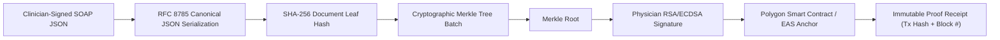

# VeriCare AI — Cryptographic Trust Layer & Ledger Anchoring

## 1. Cryptographic Principles & Non-Repudiation

Healthcare records synthesized or audited by AI cannot simply rely on traditional database timestamps, which can be modified by database administrators or altered in data breaches.

VeriCare AI implements a **zero-trust, court-admissible cryptographic trust pipeline**:



---

## 2. Canonicalization Protocol (RFC 8785)

Different programming languages and JSON parsers reorder object keys and serialize floats differently. To ensure that calculating the hash of a clinical record produces the exact same cryptographic digest regardless of where or when it is verified, VeriCare enforces **RFC 8785 (JSON Canonicalization Scheme - JCS)**:

1. **Whitespace Elimination:** No insignificant whitespace between tokens.
2. **Deterministic Key Ordering:** Object keys sorted lexicographically by UTF-16 code units.
3. **Number Serialization:** Float representation follows ECMAScript / IEEE 754 standards.
4. **UTF-8 Encoding:** Serialized strictly to raw UTF-8 octets.

### Canonical Hash Function:
$$\text{DocumentHash} = \text{SHA256}(\text{JCS}(\text{SOAP\_Payload}))$$

---

## 3. High-Throughput Merkle Tree Batching

Anchoring each individual patient report directly to the blockchain would incur unnecessary transaction latency and gas fees. Instead, VeriCare AI batches encounter hashes using a **SHA-256 Merkle Tree**:

```
                  [ Merkle Root R ]  <--- Anchored to Polygon
                     /          \
             [ Hash 0-1 ]     [ Hash 2-3 ]
              /        \        /        \
          [ H_0 ]    [ H_1 ]  [ H_2 ]   [ H_3 ]
             |          |        |         |
          Encounter  Encounter Encounter Encounter
             #1         #2       #3        #4
```

### Merkle Proof Verification:
To verify that Encounter #1 ($H_0$) is anchored in Root $R$, the client only requires:
- The leaf hash: $H_0$
- The sibling path: $[H_1, \text{Hash 2-3}]$
- The on-chain root: $R$

$$\text{Verify}(H_0, \text{Path}) \iff \text{SHA256}(\text{SHA256}(H_0, H_1) \parallel \text{Hash 2-3}) = R$$

**Cost Efficiency:** A single on-chain transaction costing $< \$0.001$ on Polygon can anchor 1,000+ clinical reports simultaneously with zero disclosure of patient health information.

---

## 4. Digital Signature & Non-Repudiation

Before anchoring, the Merkle root is signed with the attending physician's or medical institution's cryptographic key:

1. **Algorithm:** RSA PSS 4096-bit with SHA-256 or ECDSA secp256k1.
2. **Key Storage:** Hospital hardware security modules (HSM) or HashiCorp Vault.
3. **Payload Signed:**
   ```json
   {
     "merkle_root": "0x4f8a...3e1b",
     "batch_id": "BATCH-2026-10-06-004",
     "clinic_npi": "1942083921",
     "timestamp_iso": "2026-10-06T13:20:00Z"
   }
   ```

---

## 5. Polygon Smart Contract & Ethereum Attestation Service (EAS)

VeriCare AI deploys an append-only registry smart contract on Polygon PoS (and Amoy Testnet):

```solidity
// SPDX-License-Identifier: MIT
pragma solidity ^0.8.20;

contract VeriCareLedger {
    struct Anchor {
        bytes32 merkleRoot;
        string clinicId;
        uint256 timestamp;
        uint256 blockNumber;
        bytes signature;
    }

    mapping(bytes32 => Anchor) public anchors;
    event DocumentBatchAnchored(bytes32 indexed merkleRoot, string clinicId, uint256 timestamp);

    function anchorBatch(bytes32 _merkleRoot, string calldata _clinicId, bytes calldata _signature) external {
        require(anchors[_merkleRoot].timestamp == 0, "Batch already anchored");
        anchors[_merkleRoot] = Anchor({
            merkleRoot: _merkleRoot,
            clinicId: _clinicId,
            timestamp: block.timestamp,
            blockNumber: block.number,
            signature: _signature
        });
        emit DocumentBatchAnchored(_merkleRoot, _clinicId, block.timestamp);
    }

    function verifyRoot(bytes32 _merkleRoot) external view returns (bool, uint256, string memory) {
        Anchor memory a = anchors[_merkleRoot];
        if (a.timestamp > 0) {
            return (true, a.timestamp, a.clinicId);
        }
        return (false, 0, "");
    }
}
```

---

## 6. Zero-Gas Public Verification Endpoint

Patients, insurance auditors, or legal entities can verify any medical record without paying gas fees or running Web3 wallets:

1. Client submits the downloaded `vericare_receipt.json`.
2. Endpoint executes:
   - Compute `H_doc = SHA256(JCS(SOAP_JSON))`.
   - Traverse Merkle Proof to recalculate `Root`.
   - Read smart contract state via public Polygon RPC.
   - Verify RSA/ECDSA signature against the hospital's published public key certificate.
3. Returns instant cryptographic pass/fail verification badge.
