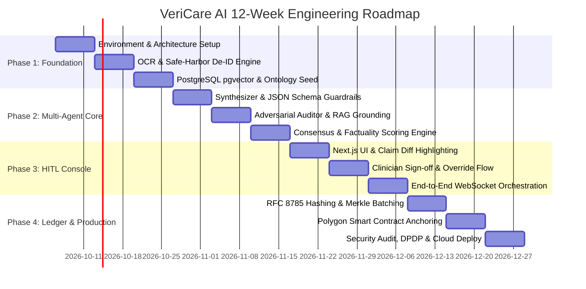

# VeriCare AI — Master Implementation Plan (12-Week Roadmap)

## Phase Breakdown Overview

---

## Sprint-by-Sprint Breakdown

### Sprint 1 (Week 1–2): Core Ingestion & Ground-Truth Pipelines
- **Deliverables:**
  1. FastAPI project scaffold with modular architecture (`api`, `core`, `agents`, `crypto`, `rag`, `models`).
  2. OCR engine supporting scanned lab PDFs, extracting text coordinates and tabular values.
  3. Safe Harbor PHI Sanitizer module stripping the 18 HIPAA identifiers while preserving patient session keys.
  4. Dockerized local stack with PostgreSQL and `pgvector` extension.
- **Acceptance Criteria:**
  - Ingesting a sample patient PDF strips patient names and addresses with 100% precision on test cases.
  - Lab panel biomarkers (e.g. Glucose, Creatinine, Hemoglobin) are parsed into normalized key-value records.

### Sprint 2 (Week 3–4): Knowledge Base & Ontology Seed
- **Deliverables:**
  1. FastEmbed / BAAI vector embedding pipeline for clinical guidelines.
  2. PostgreSQL vector index over ICD-10-CM diagnostic descriptions and drug-drug contraindication tables.
  3. Hybrid search retriever combining exact keyword lookups and dense semantic cosine distance.
- **Acceptance Criteria:**
  - Queries for contraindications (e.g. "Metformin with renal failure") return relevant guidance within < 120ms.

### Sprint 3 (Week 5–6): Multi-Agent Cognitive Core & Consensus
- **Deliverables:**
  1. LangGraph state machine orchestrating Synthesizer Agent, Claim Decomposer, and Adversarial Auditor.
  2. Strict Pydantic / JSON schema validator for SOAP note generation.
  3. Atomic claim extraction decomposing complex medical statements into verifyable assertions.
  4. Consensus scoring algorithm calculating Factuality Score ($0.0 - 1.0$) with automated amber/red flags.
- **Acceptance Criteria:**
  - Synthetic hallucination injection tests trigger automated red flags with > 98% recall.
  - Zero hallucinated lab values pass without citation validation.

### Sprint 4 (Week 7–8): Human-in-the-Loop Clinician Dashboard
- **Deliverables:**
  1. Next.js 15 + Tailwind CSS physician audit interface.
  2. Interactive color-coded visualizer:
     - 🟢 **Green:** Verified and grounded against source data.
     - 🟡 **Amber:** Borderline inference requiring quick clinician check.
     - 🔴 **Red:** Flagged contradiction or medication contraindication.
  3. Side-by-side split screen showing generated SOAP note against raw uploaded lab scans.
  4. Clinician one-click override and digital sign-off.
- **Acceptance Criteria:**
  - Clinician can review, edit flagged claims, and approve an encounter in under 60 seconds.

### Sprint 5 (Week 9–10): Cryptographic Attestation & Ledger Anchoring
- **Deliverables:**
  1. Deterministic RFC 8785 JSON canonical serializer.
  2. SHA-256 Merkle tree batching service producing cryptographic inclusion proofs.
  3. Clinic digital signature generation using RSA-4096 / ECDSA.
  4. Polygon Amoy testnet smart contract deployment and Web3.py transaction anchor service.
  5. Public zero-gas verification REST endpoint.
- **Acceptance Criteria:**
  - Any single character alteration in the exported SOAP note immediately invalidates the Merkle proof.
  - Transaction hash links directly to Polygonscan for independent verification.

### Sprint 6 (Week 11–12): Hardening, Compliance & Cloud Deployment
- **Deliverables:**
  1. Google Cloud Run serverless deployment with Cloud SQL (PostgreSQL + pgvector).
  2. End-to-end TLS 1.3 encryption and Customer-Managed Encryption Keys (CMEK).
  3. DPDP Act 2023 and HIPAA compliance audit documentation.
  4. Performance benchmarking ensuring multi-agent pipeline completes within < 15 seconds.
- **Acceptance Criteria:**
  - Automated CI/CD via GitHub Actions builds, tests, and deploys without downtime.
  - Live production demonstration ready for ShivaTech CBII incubation and hackathon jury.
