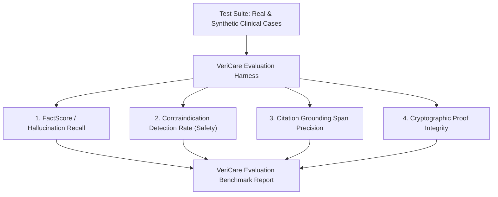

# VeriCare AI — Evaluation Framework, Metrics & Benchmarks

## 1. Overview of Clinical Evaluation Strategy

Evaluating clinical AI requires moving beyond standard NLP metrics (like BLEU or ROUGE), which only measure text overlap. VeriCare AI evaluates factual correctness, clinical safety, citation accuracy, and cryptographic non-repudiation.

---

## 2. Key Performance Indicators (KPIs) & Target Metrics

| Evaluation Metric | Mathematical Definition | Target Threshold | Clinical Impact |
| :--- | :--- | :--- | :--- |
| **Contraindication Detection Rate (CDR)** | $\frac{\text{True Contradictions Caught}}{\text{Total Injected Contradictions}}$ | **$\ge 99.0\%$** | Prevents adverse drug reactions and fatal medication errors. |
| **Hallucination Recall (HR)** | $\frac{\text{Fabricated Lab Claims Flagged}}{\text{Total Fabricated Claims}}$ | **$\ge 98.5\%$** | Stops ungrounded clinical baselines from entering permanent health records. |
| **Citation Precision (CP)** | $\frac{\text{Correct Source Spans Cited}}{\text{Total Citations Generated}}$ | **$\ge 95.0\%$** | Assures physicians that cited references point directly to authentic lab panels. |
| **False Positive Alarm Rate (FPAR)** | $\frac{\text{Safe Claims Erroneously Flagged Red}}{\text{Total Safe Claims}}$ | **$\le 4.0\%$** | Minimizes physician alert fatigue during high-volume clinical shifts. |
| **End-to-End Pipeline Latency** | Time from audio/note ingestion to audit completion | **$< 12.0$ seconds** | Enables real-time verification during live patient encounters. |
| **Cryptographic Verification Determinism** | Consistency of RFC 8785 SHA-256 hash | **$100.0\%$** | Guarantees court-admissible non-repudiation across any client parser. |

---

## 3. Synthetic Hallucination Injection Test Suite

To rigorously stress-test the Adversarial Auditor Agent, the testing framework injects controlled perturbations into clinical notes:

1. **Numerical Value Drift:** E.g., altering `Serum Potassium: 4.8 mEq/L` to `Serum Potassium: 6.2 mEq/L` (Severe Hyperkalemia).
2. **Polarity Reversal:** E.g., changing `"No family history of coronary artery disease"` to `"Strong family history of early myocardial infarction"`.
3. **Ghost Medication Insertion:** E.g., inserting a high-dose ACE-inhibitor when the patient has acute renal failure.
4. **Diagnostic Fabrications:** E.g., declaring a diagnosis of `"Congestive Heart Failure"` when BNP and echocardiogram are completely normal.

The evaluation harness automatically runs these mutated encounters through the pipeline and validates that the Consensus Engine assigns a `RED` flag and blocks automated attestation.
